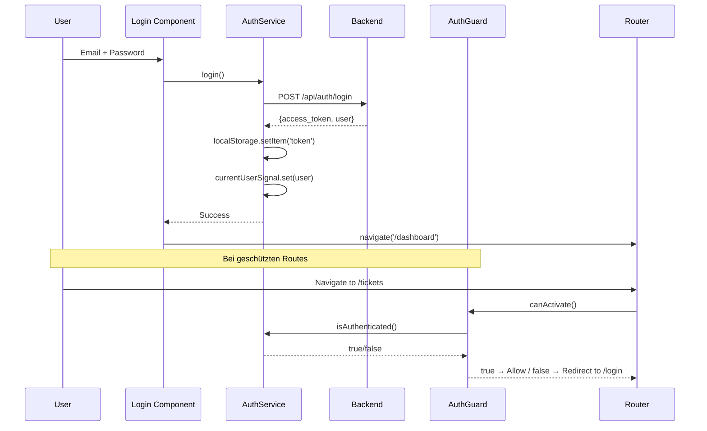

# Frontend - Issue Tracker SPA

Enterprise Angular Single Page Application mit Material Design, JWT-Authentication und rollenbasierter UI.

## 🚀 Quick Start

### Voraussetzungen

- Node.js 20.x oder höher
- npm oder yarn
- Backend muss laufen (Port 3000)

### 1. Installation

```bash
# Dependencies installieren (im Root-Verzeichnis)
npm install
```

### 2. Environment Setup

Die Environment-Variablen sind bereits konfiguriert in:

```typescript
// apps/frontend/src/environments/environment.development.ts
export const environment = {
  production: false,
  apiUrl: 'http://localhost:3000/api'
};

// apps/frontend/src/environments/environment.ts
export const environment = {
  production: true,
  apiUrl: '/api'  // Production nutzt Relative URLs
};
```

### 3. Frontend starten

```bash
# Development Server mit Hot-Reload
npm run dev:frontend

# Oder via Nx
npx nx serve frontend
```

Frontend läuft auf: **http://localhost:4200**

## 📱 Features

### Authentifizierung
- ✅ Login/Logout mit JWT
- ✅ Automatische Token-Speicherung (localStorage)
- ✅ Auth Guard für geschützte Routes
- ✅ Redirect nach Login

### Dashboard
- ✅ Projekt- & Ticket-Statistiken
- ✅ Chart-Visualisierungen (ApexCharts)
- ✅ Quick Actions

### Projekt-Management
- ✅ Projekt-Liste mit Filtern
- ✅ Projekt-Details mit Tabs
- ✅ Mitglieder-Verwaltung
- ✅ Label-Verwaltung

### Ticket-Management
- ✅ Ticket-Liste mit Sortierung & Filterung
- ✅ Ticket-Details mit Tabs (Overview, Comments, Activity)
- ✅ Inline-Editing von Tickets
- ✅ Drag & Drop Status-Änderung (geplant)
- ✅ Label-Tagging

### Kommentar-System
- ✅ Kommentare erstellen/bearbeiten/löschen
- ✅ Rich-Text-Editor (geplant)
- ✅ Real-time Updates (geplant mit WebSockets)

## 🏗️ Architektur

### Standalone Components (Angular 20)

Keine NgModules - alle Components sind Standalone:

```typescript
@Component({
  selector: 'app-dashboard',
  standalone: true,
  imports: [CommonModule, MatCardModule, ...],
  templateUrl: './dashboard.html'
})
export class Dashboard { }
```

### Signal-based State Management

```typescript
export class TicketsService {
  private ticketsSignal = signal<Ticket[]>([]);
  tickets = this.ticketsSignal.asReadonly();
  
  loadTickets(): void {
    this.http.get<Ticket[]>('/api/tickets')
      .subscribe(tickets => this.ticketsSignal.set(tickets));
  }
}
```

### Reactive Programming (RxJS)

```typescript
// HTTP Requests
this.ticketsService.getTickets().pipe(
  catchError(err => {
    this.errorService.handleHttpError(err, 'Fehler beim Laden der Tickets');
    return of([]);
  })
).subscribe(tickets => this.tickets = tickets);
```

### Dependency Injection via inject()

```typescript
export class TicketDetail {
  private ticketsService = inject(TicketsService);
  private route = inject(ActivatedRoute);
  private errorService = inject(ErrorService);
}
```

## 📁 Projekt-Struktur

```
apps/frontend/src/
├── app/
│   ├── core/                    # Core Services & Guards
│   │   ├── services/
│   │   │   ├── auth.service.ts
│   │   │   ├── error.service.ts
│   │   │   ├── tickets.service.ts
│   │   │   └── projects.service.ts
│   │   ├── guards/
│   │   │   └── auth.guard.ts
│   │   └── layout/
│   │       └── layout.ts        # Main Layout mit Sidebar
│   ├── features/                # Feature Modules
│   │   ├── auth/
│   │   │   └── login/
│   │   ├── dashboard/
│   │   ├── projects/
│   │   │   ├── projects.ts
│   │   │   └── project-detail/
│   │   │       ├── components/
│   │   │       │   ├── tickets-tab/
│   │   │       │   ├── management-tab/
│   │   │       │   └── settings-tab/
│   │   │       └── project-detail.ts
│   │   └── tickets/
│   │       ├── tickets-overview/
│   │       └── ticket-detail/
│   │           └── components/
│   │               ├── ticket-overview-tab/
│   │               ├── ticket-comments-tab/
│   │               └── ticket-activity-tab/
│   ├── app.config.ts           # App Configuration
│   ├── app.routes.ts           # Routing
│   └── app.html                # Root Template
├── environments/
│   ├── environment.ts
│   └── environment.development.ts
├── styles.scss                 # Global Styles
└── index.html
```

## 🎨 Material Design

### Theme

Custom Material Theme in `styles.scss`:

```scss
@use '@angular/material' as mat;

$primary: mat.define-palette(mat.$indigo-palette);
$accent: mat.define-palette(mat.$pink-palette);
$theme: mat.define-light-theme((
  color: (primary: $primary, accent: $accent)
));

@include mat.all-component-themes($theme);
```

### Komponenten

- ✅ MatToolbar - Navigation
- ✅ MatSidenav - Sidebar
- ✅ MatCard - Content Cards
- ✅ MatTable - Data Tables
- ✅ MatDialog - Modals
- ✅ MatSnackBar - Notifications
- ✅ MatChips - Labels
- ✅ MatForm - Forms

## 🔐 Authentifizierung & Authorization

### Auth Flow



### RBAC-aware UI

```typescript
// Conditional Rendering basierend auf User-Rolle
export class ProjectDetail {
  currentUser = inject(AuthService).currentUser;
  
  canManageMembers(): boolean {
    const role = this.currentUser()?.role;
    return role === UserRole.MANAGER || role === UserRole.ADMIN;
  }
}
```

```html
<!-- Template -->
@if (canManageMembers()) {
  <button mat-raised-button (click)="openMembersDialog()">
    Mitglieder verwalten
  </button>
}
```

## 🛡️ Error Handling

### Centralized ErrorService

```typescript
@Injectable({ providedIn: 'root' })
export class ErrorService {
  private snackBar = inject(MatSnackBar);
  
  handleHttpError(error: HttpErrorResponse, context: string): void {
    const message = this.extractErrorMessage(error);
    this.showError(`${context}: ${message}`);
    this.logError(context, error);
  }
  
  showError(message: string): void {
    this.snackBar.open(message, 'Schließen', {
      duration: 5000,
      panelClass: ['error-snackbar']
    });
  }
}
```

### Usage

```typescript
this.ticketsService.updateTicket(id, dto).subscribe({
  next: (ticket) => this.ticket = ticket,
  error: (err) => {
    inject(ErrorService).handleHttpError(err, 'Fehler beim Aktualisieren des Tickets');
  }
});
```

## 🧪 Testing

### Unit Tests

```bash
# Alle Frontend-Tests
npx nx test frontend

# Mit Coverage
npx nx test frontend --coverage

# Watch Mode
npx nx test frontend --watch
```

### E2E Tests (Cypress)

```bash
# Cypress öffnen
npx nx e2e frontend-e2e

# Headless ausführen
npx nx e2e frontend-e2e --headless
```

## 🏗️ Build & Deployment

### Development Build

```bash
npx nx build frontend
```

### Production Build

```bash
npx nx build frontend --configuration=production
```

Output: `dist/apps/frontend/browser/`

### Docker Build

```bash
# Frontend Image bauen
docker build -f apps/frontend/Dockerfile -t issue-tracker-frontend .

# Container starten
docker run -p 80:80 issue-tracker-frontend
```

## 🔧 Development

### Verfügbare Scripts

```bash
# Development Server
npm run dev:frontend

# Production Build
npx nx build frontend --configuration=production

# Tests
npx nx test frontend

# Linting
npx nx lint frontend

# Type Check
npx tsc --noEmit -p apps/frontend/tsconfig.app.json
```

### Proxy Configuration

API-Requests werden im Development-Modus geproxied:

```json
// apps/frontend/proxy.conf.json
{
  "/api": {
    "target": "http://localhost:3000",
    "secure": false,
    "changeOrigin": true
  }
}
```

## 📊 Performance

### Optimizations

- ✅ **OnPush Change Detection** - Reduzierte Change Detection Cycles
- ✅ **Lazy Loading** - Routes werden on-demand geladen
- ✅ **TrackBy** - Optimierte ngFor Performance
- ✅ **Standalone Components** - Kleinere Bundle Size
- ✅ **Tree-shaking** - Ungenutzte Code wird entfernt

### Bundle Analysis

```bash
# Bundle Analyzer
npx nx build frontend --stats-json
npx webpack-bundle-analyzer dist/apps/frontend/browser/stats.json
```

## 🐛 Debugging

### Angular DevTools

1. Chrome Extension installieren: Angular DevTools
2. Frontend starten
3. DevTools öffnen → Angular Tab
4. Component Tree & Profiler nutzen

### RxJS Debugging

```typescript
import { tap } from 'rxjs/operators';

this.tickets$ = this.ticketsService.getTickets().pipe(
  tap(tickets => console.log('Loaded tickets:', tickets)),
  catchError(err => {
    console.error('Error:', err);
    return of([]);
  })
);
```

## 📚 Weitere Dokumentation

- [Frontend Folder Structure](../../docs/guides/frontend/folder-structure.md)
- [Layout Integration](../../docs/guides/frontend/layout-integration.md)
- [Auth Implementation](../../docs/guides/frontend/auth/login-implementation.md)
- [Backend API Docs](http://localhost:3000/api/docs)

## 🤝 Contributing

Siehe [CONTRIBUTING.md](../../CONTRIBUTING.md) für Development Guidelines.

## 📝 License

MIT - Siehe [LICENSE](../../LICENSE)
