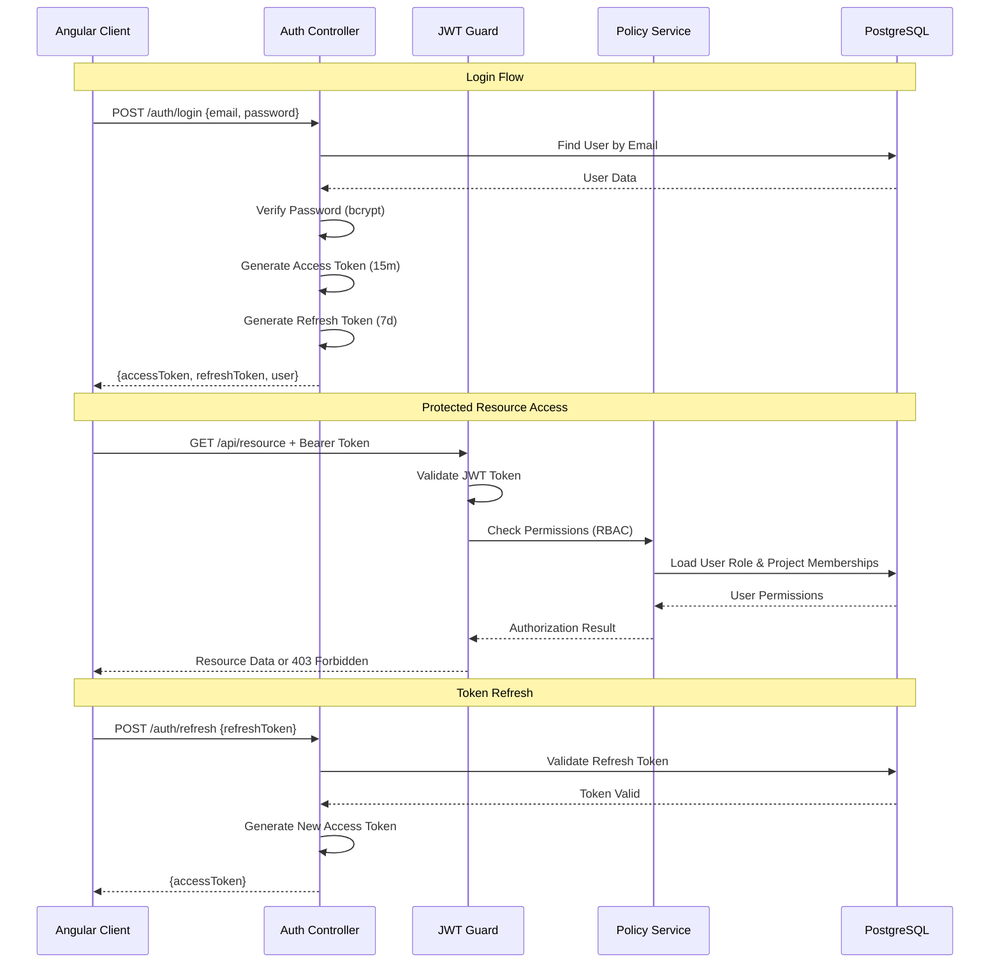
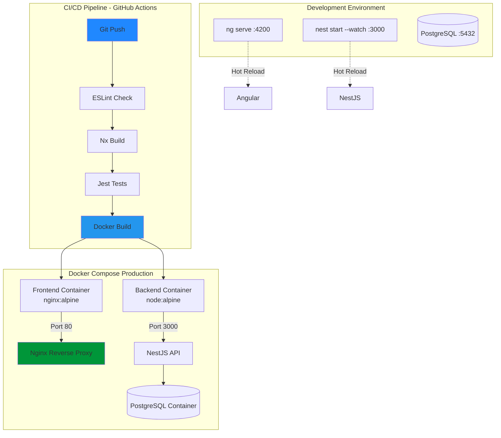
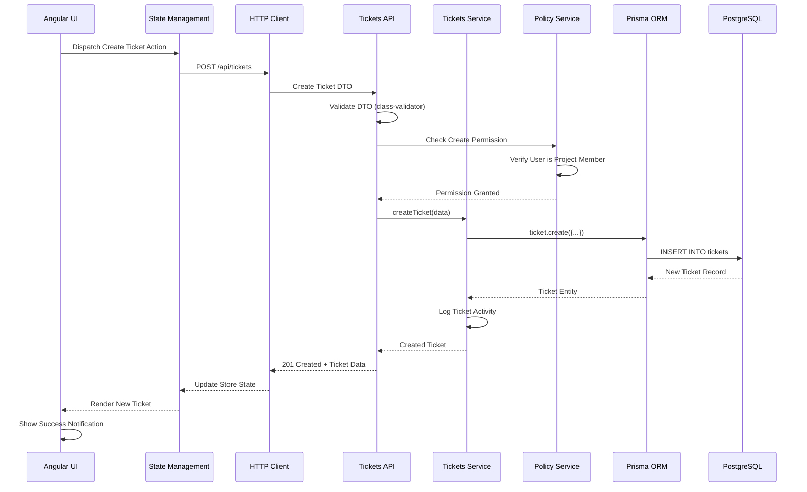
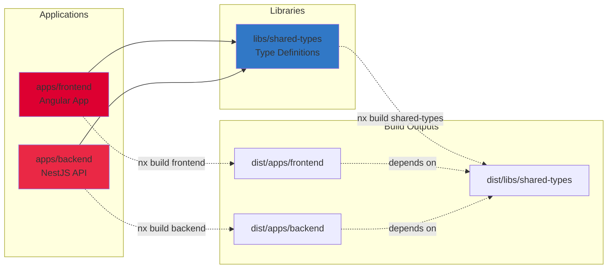
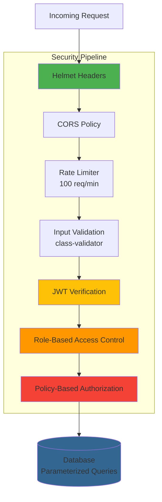

```mermaid
graph TB
    subgraph "Client Layer"
        Browser[Web Browser]
        Angular[Angular 20.3 SPA]
    end

    subgraph "Nx Monorepo Workspace"
        subgraph "Frontend App"
            AuthModule[Auth Module]
            DashboardModule[Dashboard Module]
            ProjectsModule[Projects Module]
            TicketsModule[Tickets Module]
            SharedModule[Shared Module]
        end

        subgraph "Backend App"
            AuthAPI[Auth Controller]
            UsersAPI[Users Controller]
            ProjectsAPI[Projects Controller]
            TicketsAPI[Tickets Controller]
            CommentsAPI[Comments Controller]
            LabelsAPI[Labels Controller]
            DashboardAPI[Dashboard Controller]
        end

        subgraph "Shared Library"
            SharedTypes[Shared Types Library]
        end
    end

    subgraph "Backend Services Layer"
        AuthService[Auth Service]
        UsersService[Users Service]
        ProjectsService[Projects Service]
        TicketsService[Tickets Service]
        CommentsService[Comments Service]
        PolicyService[Policy Service]
    end

    subgraph "Data Layer"
        Prisma[Prisma ORM]
        PostgreSQL[(PostgreSQL Database)]
    end

    subgraph "Security & Middleware"
        JWTGuard[JWT Guard]
        RateLimiter[Rate Limiter]
        CORS[CORS Config]
        ValidationPipe[Validation Pipe]
    end

    Browser --> Angular
    Angular --> AuthModule
    Angular --> DashboardModule
    Angular --> ProjectsModule
    Angular --> TicketsModule
    Angular --> SharedModule

    AuthModule --> AuthAPI
    DashboardModule --> DashboardAPI
    ProjectsModule --> ProjectsAPI
    TicketsModule --> TicketsAPI
    TicketsModule --> CommentsAPI
    ProjectsModule --> LabelsAPI

    SharedTypes -.->|Type Safety| AuthModule
    SharedTypes -.->|Type Safety| ProjectsModule
    SharedTypes -.->|Type Safety| TicketsModule
    SharedTypes -.->|Type Safety| AuthAPI
    SharedTypes -.->|Type Safety| ProjectsAPI
    SharedTypes -.->|Type Safety| TicketsAPI

    AuthAPI --> JWTGuard
    AuthAPI --> AuthService
    UsersAPI --> UsersService
    ProjectsAPI --> ProjectsService
    TicketsAPI --> TicketsService
    CommentsAPI --> CommentsService

    JWTGuard --> RateLimiter
    RateLimiter --> CORS
    CORS --> ValidationPipe

    AuthService --> PolicyService
    ProjectsService --> PolicyService
    TicketsService --> PolicyService

    AuthService --> Prisma
    UsersService --> Prisma
    ProjectsService --> Prisma
    TicketsService --> Prisma
    CommentsService --> Prisma

    Prisma --> PostgreSQL

    style Browser fill:#e1f5ff
    style Angular fill:#dd0031
    style PostgreSQL fill:#336791
    style Prisma fill:#2D3748
    style SharedTypes fill:#3178c6
```

# Issue Tracker - Architekturdiagramm

## 🏗️ System-Architektur Übersicht



## 🗂️ Datenbank Schema

> **📊 Vollständiges ER-Diagramm:** Siehe [database-erd.md](database-erd.md) (automatisch generiert mit Prisma ERD Generator)

## 🔐 Authentifizierung & Autorisierung Flow



## 📊 Backend Module Struktur

```mermaid
graph LR
    subgraph "NestJS Backend"
        AppModule[App Module]

        subgraph "Feature Modules"
            AuthMod[Auth Module]
            UsersMod[Users Module]
            ProjectsMod[Projects Module]
            TicketsMod[Tickets Module]
            CommentsMod[Comments Module]
            LabelsMod[Labels Module]
            DashboardMod[Dashboard Module]
            TicketActivitiesMod[Ticket Activities Module]
        end

        subgraph "Core Module"
            DatabaseMod[Database Module]
            HealthMod[Health Module]
            ConfigMod[Config Module]
        end

        subgraph "Guards & Middleware"
            JWTGuard[JWT Auth Guard]
            RoleGuard[Role Guard]
            ThrottlerGuard[Throttler Guard]
        end
    end

    AppModule --> AuthMod
    AppModule --> UsersMod
    AppModule --> ProjectsMod
    AppModule --> TicketsMod
    AppModule --> CommentsMod
    AppModule --> LabelsMod
    AppModule --> DashboardMod
    AppModule --> TicketActivitiesMod
    AppModule --> DatabaseMod
    AppModule --> HealthMod
    AppModule --> ConfigMod

    AuthMod -.-> JWTGuard
    ProjectsMod -.-> JWTGuard
    TicketsMod -.-> JWTGuard

    ProjectsMod -.-> RoleGuard
    TicketsMod -.-> RoleGuard

    AppModule -.-> ThrottlerGuard

    style AppModule fill:#ea2845
    style DatabaseMod fill:#2D3748
    style JWTGuard fill:#4CAF50
```



## 🎨 Frontend Routing & Module Architektur

```mermaid
graph TD
    AppRoot[App Root]

    subgraph "Public Routes"
        Login[Login /login]
        Register[Register /register]
    end

    subgraph "Protected Routes - Authenticated"
        Dashboard[Dashboard /dashboard]

        subgraph "Projects Feature"
            ProjectsList[Projects List /projects]
            ProjectDetail[Project Detail /projects/:id]
            ProjectTabs[Tabs: Overview | Tickets | Members | Settings]
        end

        subgraph "Tickets Feature"
            TicketsList[Tickets List /tickets]
            TicketDetail[Ticket Detail /tickets/:id]
            TicketComponents[Components: Comments | Activity | Labels]
        end

        Profile[User Profile /profile]
        Settings[Settings /settings]
    end

    AppRoot --> Login
    AppRoot --> Register
    AppRoot --> Dashboard
    AppRoot --> ProjectsList
    AppRoot --> TicketsList
    AppRoot --> Profile
    AppRoot --> Settings

    ProjectsList --> ProjectDetail
    ProjectDetail --> ProjectTabs

    TicketsList --> TicketDetail
    TicketDetail --> TicketComponents

    Dashboard -.->|Quick Stats| ProjectsList
    Dashboard -.->|Recent Tickets| TicketsList

    style Login fill:#90CAF9
    style Dashboard fill:#81C784
    style ProjectDetail fill:#FFB74D
    style TicketDetail fill:#E57373
```

## 🚀 Deployment & Infrastructure



## 🔄 Data Flow - Ticket Creation



## 📦 Nx Monorepo Dependency Graph



## 🛡️ Security Layers



---

## 📝 Legende

| Symbol     | Bedeutung                        |
| ---------- | -------------------------------- |
| `[ ]`      | Komponente/Modul                 |
| `( )`      | Datenbank                        |
| `-->`      | Datenfluss/Abhängigkeit          |
| `-.->`     | Optionale/Type-Only Abhängigkeit |
| **Farben** | Technology-spezifisch            |
| 🔴 Red     | Angular/NestJS                   |
| 🔵 Blue    | TypeScript/Prisma                |
| 🟢 Green   | Security/Auth                    |
| 🟡 Yellow  | Database                         |

---

**Erstellt am:** 28. Dezember 2025  
**Version:** 1.0.0  
**Projekt:** Issue Tracker Nx Monorepo
