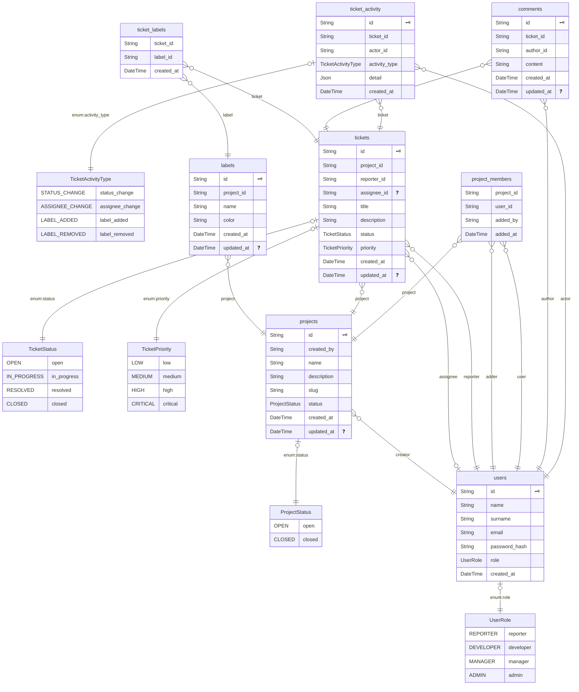

```mermaid
erDiagram

        UserRole {
            REPORTER reporter
DEVELOPER developer
MANAGER manager
ADMIN admin
        }
    


        ProjectStatus {
            OPEN open
CLOSED closed
        }
    


        TicketStatus {
            OPEN open
IN_PROGRESS in_progress
RESOLVED resolved
CLOSED closed
        }
    


        TicketPriority {
            LOW low
MEDIUM medium
HIGH high
CRITICAL critical
        }
    


        TicketActivityType {
            STATUS_CHANGE status_change
ASSIGNEE_CHANGE assignee_change
LABEL_ADDED label_added
LABEL_REMOVED label_removed
        }
    
  "users" {
    String id "🗝️"
    String name 
    String surname 
    String email 
    String password_hash 
    UserRole role 
    DateTime created_at 
    }
  

  "projects" {
    String id "🗝️"
    String created_by 
    String name 
    String description 
    String slug 
    ProjectStatus status 
    DateTime created_at 
    DateTime updated_at "❓"
    }
  

  "labels" {
    String id "🗝️"
    String project_id 
    String name 
    String color 
    DateTime created_at 
    DateTime updated_at "❓"
    }
  

  "tickets" {
    String id "🗝️"
    String project_id 
    String reporter_id 
    String assignee_id "❓"
    String title 
    String description 
    TicketStatus status 
    TicketPriority priority 
    DateTime created_at 
    DateTime updated_at "❓"
    }
  

  "ticket_labels" {
    String ticket_id 
    String label_id 
    DateTime created_at 
    }
  

  "project_members" {
    String project_id 
    String user_id 
    String added_by 
    DateTime added_at 
    }
  

  "comments" {
    String id "🗝️"
    String ticket_id 
    String author_id 
    String content 
    DateTime created_at 
    DateTime updated_at "❓"
    }
  

  "ticket_activity" {
    String id "🗝️"
    String ticket_id 
    String actor_id 
    TicketActivityType activity_type 
    Json detail 
    DateTime created_at 
    }
  
    "users" |o--|| "UserRole" : "enum:role"
    "projects" |o--|| "ProjectStatus" : "enum:status"
    "projects" }o--|| users : "creator"
    "labels" }o--|| projects : "project"
    "tickets" |o--|| "TicketStatus" : "enum:status"
    "tickets" |o--|| "TicketPriority" : "enum:priority"
    "tickets" }o--|o users : "assignee"
    "tickets" }o--|| projects : "project"
    "tickets" }o--|| users : "reporter"
    "ticket_labels" }o--|| labels : "label"
    "ticket_labels" }o--|| tickets : "ticket"
    "project_members" }o--|| users : "adder"
    "project_members" }o--|| projects : "project"
    "project_members" }o--|| users : "user"
    "comments" }o--|| users : "author"
    "comments" }o--|| tickets : "ticket"
    "ticket_activity" |o--|| "TicketActivityType" : "enum:activity_type"
    "ticket_activity" }o--|| users : "actor"
    "ticket_activity" }o--|| tickets : "ticket"
```
