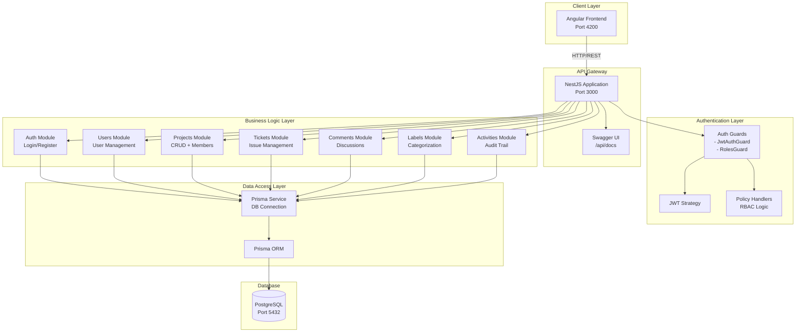
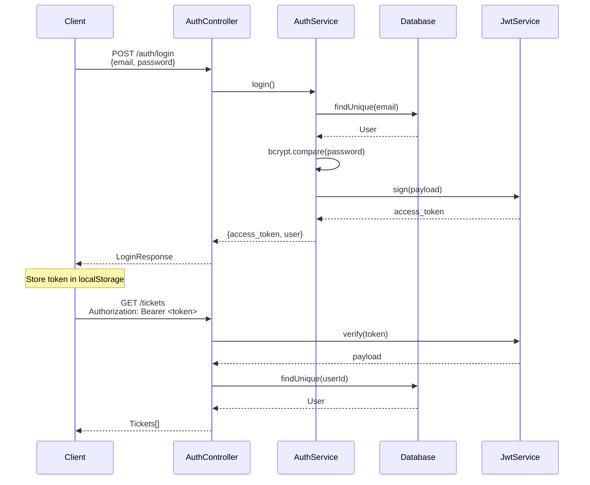
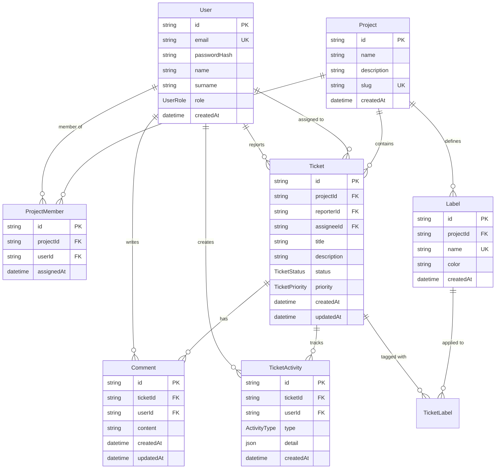
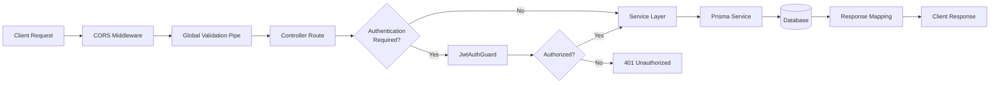

# Backend Architecture

## 🏗️ System-Architektur



## 📁 Modul-Struktur

```
apps/backend/src/
├── app/
│   ├── auth/              # Authentifizierung & Authorization
│   │   ├── services/      # AuthService, JwtStrategy
│   │   ├── guards/        # JwtAuthGuard, RolesGuard
│   │   ├── policies/      # Policy Handlers (RBAC)
│   │   └── decorators/    # Custom Decorators
│   ├── users/             # Benutzerverwaltung
│   ├── projects/          # Projektverwaltung
│   ├── tickets/           # Ticket/Issue Management
│   ├── comments/          # Kommentarsystem
│   ├── labels/            # Label-Verwaltung
│   ├── ticket-activities/ # Aktivitätsverfolgung
│   ├── dashboard/         # Dashboard-Statistiken
│   ├── health/            # Health Checks
│   ├── database/          # Prisma Service
│   └── core/              # App Module, Global Config
├── main.ts                # Bootstrap & Swagger Config
└── prisma/
    ├── schema.prisma      # Datenbank-Schema
    ├── migrations/        # Migration History
    └── seed.ts            # Seed Data
```

## 🔐 Authentifizierung & Authorization

### 1. JWT-basierte Authentifizierung



### 2. RBAC (Role-Based Access Control)

| Rolle         | Beschreibung    | Berechtigungen                                                                                                |
| ------------- | --------------- | ------------------------------------------------------------------------------------------------------------- |
| **Reporter**  | Basis-Nutzer    | - Tickets erstellen (nur title/description)<br/>- Eigene Tickets bearbeiten<br/>- Kommentare schreiben        |
| **Developer** | Entwickler      | - Reporter Rechte +<br/>- Tickets sich selbst zuweisen<br/>- Priorität setzen<br/>- Status ändern             |
| **Manager**   | Projekt-Manager | - Developer Rechte +<br/>- Tickets anderen zuweisen<br/>- Projekt-Mitglieder verwalten<br/>- Labels verwalten |
| **Admin**     | System-Admin    | - Alle Rechte<br/>- User-Verwaltung<br/>- Projekt slug ändern                                                 |

### 3. Policy-basierte Authorization

```typescript
// Beispiel: UpdateTicketPolicy
@Injectable()
export class UpdateTicketPolicyHandler {
  canUpdate(user: User, ticket: Ticket): boolean {
    // Admin: Alle Rechte
    if (user.role === UserRole.ADMIN) return true;

    // Reporter: Nur eigene Tickets
    if (user.role === UserRole.REPORTER) {
      return ticket.reporterId === user.id;
    }

    // Developer/Manager: Eigene + zugewiesene
    return ticket.reporterId === user.id || ticket.assigneeId === user.id;
  }
}
```

## 💾 Datenbank-Schema



## 🔄 Request Lifecycle



## 🛡️ Security Features

### Input Validation

- **ValidationPipe** mit `class-validator` DTOs
- **Whitelist**: Unbekannte Properties werden entfernt
- **Transform**: Automatische Type Conversion

### Authentication

- **bcrypt** für Password Hashing (Salting + 10 Rounds)
- **JWT** mit 512-bit Secret (HS256 Algorithm)
- **Token Expiration**: 1 Stunde Access Token

### Authorization

- **Guards**: Route-Level Protection
- **Policies**: Business-Logic-Level Authorization
- **RBAC**: Rollenbasierte Zugriffskontrolle

### CORS

- **Allowed Origins**: Whitelist für Frontend-URLs
- **Credentials**: Cookie/Auth Header Support
- **Methods**: Nur benötigte HTTP-Methoden

### Rate Limiting

- **100 Requests/Minute** pro IP
- Schutz vor DDoS und Brute-Force

## 📊 API-Dokumentation

Die vollständige API-Dokumentation ist via Swagger UI verfügbar:

**Development:**

```
http://localhost:3000/api/docs
```

**Features:**

- ✅ Interaktive API-Exploration
- ✅ Request/Response Schemas
- ✅ JWT-Authentication Testing
- ✅ Try-it-out Funktionalität
- ✅ Modell-Definitionen

## 🚀 Performance-Optimierungen

### Database

- **Connection Pooling** via Prisma (max 10 Connections)
- **Query Optimization** mit Prisma `select` und `include`
- **Indizes** auf häufig verwendete Felder (email, slug, projectId, etc.)

### Caching

- **JWT Payload** wird nicht bei jedem Request validiert (stateless)
- **Prisma Query Engine** cached Prepared Statements

### Logging

- **Production**: Nur errors, warnings, logs
- **Development**: Full debug output
- **Structured Logging** für bessere Filterbarkeit

## 🏥 Health Checks

```typescript
GET /api/health
{
  "status": "ok",
  "info": {
    "database": { "status": "up" }
  }
}
```

## 🔧 Entwicklung

Siehe [Backend README](../../apps/backend/README.md) für Setup-Instruktionen.

## 📚 Weitere Dokumentation

- [Auth Guards](./guides/backend/auth/authentication-guards.md)
- [JWT Implementation](./guides/backend/auth/jwt-implementation-guide.md)
- [Policy System](./guides/backend/policy/policy-system-implementation.md)
- [Mapping Strategy](./guides/backend/MAPPING_STRATEGY.md)
