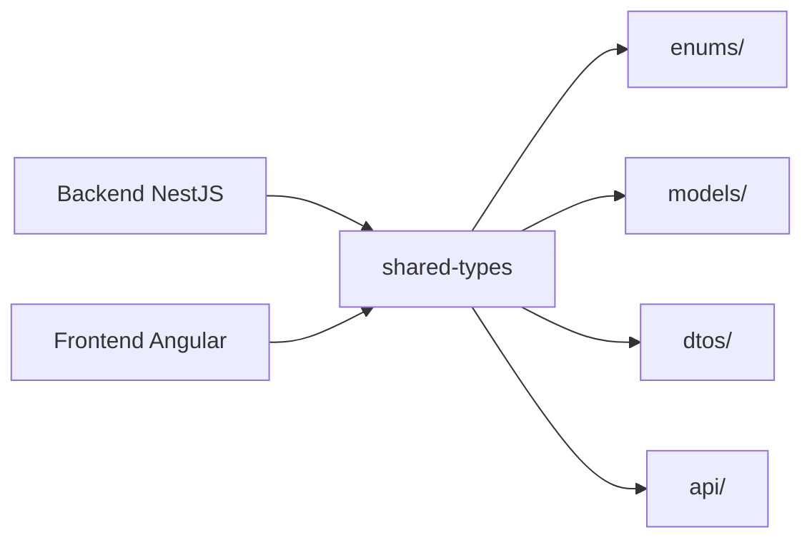

# @issue-tracker/shared-types

Shared TypeScript type definitions and contracts for the Issue Tracker monorepo.

## 🎯 Zweck

Diese Library stellt **typsichere Schnittstellen** zwischen Backend (NestJS) und Frontend (Angular) bereit und garantiert:

- ✅ **Single Source of Truth** für alle API-Contracts
- ✅ **Compile-Time Type Safety** über Projekt-Grenzen hinweg
- ✅ **Keine Type-Duplikation** zwischen Frontend und Backend
- ✅ **Refactoring-Sicherheit** - Änderungen werden sofort in beiden Apps sichtbar
- ✅ **Automatische IntelliSense** in beiden Projekten

## 📁 Struktur

```
libs/shared-types/src/lib/
├── enums/              # Shared Enumerations
│   ├── user.enums.ts   # UserRole
│   ├── ticket.enums.ts # TicketStatus, TicketPriority
│   └── project.enums.ts# ProjectMemberRole (deprecated)
├── models/             # Domain Models (Entities)
│   ├── user.model.ts
│   ├── project.model.ts
│   ├── ticket.model.ts
│   ├── label.model.ts
│   ├── comment.model.ts
│   └── dashboard.model.ts
├── dtos/               # Data Transfer Objects (API Payloads)
│   ├── user.dto.ts
│   ├── project.dto.ts
│   ├── ticket.dto.ts
│   ├── label.dto.ts
│   └── comment.dto.ts
├── api/                # API Response Types & Filters
│   ├── responses.ts    # LoginResponse, etc.
│   └── filters.ts      # FilterOptions, PaginationOptions
├── constants/          # Shared Constants
│   └── pagination.ts   # DEFAULT_PAGE_SIZE, MAX_PAGE_SIZE
└── utils/              # Type Utilities & Helpers
    └── type-guards.ts  # isUser(), isTicket(), etc.
```

## 🔑 Kern-Typen

### Enums

```typescript
// User Roles (RBAC)
export enum UserRole {
  REPORTER = 'REPORTER', // Kann Tickets erstellen
  DEVELOPER = 'DEVELOPER', // Kann Tickets bearbeiten
  MANAGER = 'MANAGER', // Kann Projekt verwalten
  ADMIN = 'ADMIN', // Alle Rechte
}

// Ticket Status
export enum TicketStatus {
  OPEN = 'OPEN',
  IN_PROGRESS = 'IN_PROGRESS',
  IN_REVIEW = 'IN_REVIEW',
  RESOLVED = 'RESOLVED',
  CLOSED = 'CLOSED',
}

// Ticket Priority
export enum TicketPriority {
  LOW = 'LOW',
  MEDIUM = 'MEDIUM',
  HIGH = 'HIGH',
  CRITICAL = 'CRITICAL',
}
```

### Domain Models

```typescript
// User Entity
export interface User {
  id: string;
  email: string;
  name: string;
  surname: string;
  role: UserRole;
  createdAt: Date;
}

// Ticket Entity
export interface Ticket {
  id: string;
  projectId: string;
  reporterId: string;
  assigneeId?: string;
  title: string;
  description: string;
  status: TicketStatus;
  priority: TicketPriority;
  labelIds: string[];
  createdAt: Date;
  updatedAt: Date;
}

// Project Entity
export interface Project {
  id: string;
  name: string;
  description: string;
  slug: string;
  createdAt: Date;
}
```

### DTOs (Data Transfer Objects)

```typescript
// Create Ticket Payload
export interface CreateTicketDto {
  title: string;
  description: string;
  priority?: TicketPriority;
  assigneeId?: string;
  labelIds?: string[];
}

// Update Ticket Payload
export interface UpdateTicketDto {
  title?: string;
  description?: string;
  status?: TicketStatus;
  priority?: TicketPriority;
  assigneeId?: string;
  labelIds?: string[];
}

// Login Credentials
export interface LoginDto {
  email: string;
  password: string;
}
```

### API Response Types

```typescript
// Authentication Response
export interface LoginResponse {
  access_token: string;
  user: User;
}

// Ticket with Relations
export interface TicketWithDetails {
  ticket: Ticket;
  reporter: User;
  assignee?: User;
  labels: Label[];
  commentCount: number;
}
```

## 🔄 Verwendung

### Im Backend (NestJS)

```typescript
// Controller
import { CreateTicketDto, Ticket } from '@issue-tracker/shared-types';

@Controller('tickets')
export class TicketsController {
  @Post()
  create(@Body() dto: CreateTicketDto): Promise<Ticket> {
    return this.ticketsService.create(dto);
  }
}

// Service
import { TicketStatus, TicketPriority } from '@issue-tracker/shared-types';

@Injectable()
export class TicketsService {
  async create(dto: CreateTicketDto): Promise<Ticket> {
    // TypeScript kennt alle Properties von CreateTicketDto
    return this.prisma.ticket.create({
      data: {
        title: dto.title,
        description: dto.description,
        status: TicketStatus.OPEN,
        priority: dto.priority || TicketPriority.MEDIUM,
      },
    });
  }
}
```

### Im Frontend (Angular)

```typescript
// Service
import { CreateTicketDto, Ticket } from '@issue-tracker/shared-types';

@Injectable()
export class TicketsService {
  createTicket(dto: CreateTicketDto): Observable<Ticket> {
    // TypeScript validiert automatisch dass dto alle required fields hat
    return this.http.post<Ticket>('/api/tickets', dto);
  }
}

// Component
import { TicketStatus, TicketPriority } from '@issue-tracker/shared-types';

export class TicketFormComponent {
  statusOptions = Object.values(TicketStatus);
  priorityOptions = Object.values(TicketPriority);

  onSubmit(form: FormGroup) {
    const dto: CreateTicketDto = {
      title: form.value.title,
      description: form.value.description,
      priority: form.value.priority,
    };
    // Compile-time check: alle required properties müssen gesetzt sein
  }
}
```

## ✨ Vorteile

### 1. Type Safety über API-Grenzen

```typescript
// ❌ VORHER: Duplikation & Fehleranfälligkeit
// Backend
interface CreateTicketDto {
  title: string;
  description: string;
}

// Frontend (separat definiert!)
interface CreateTicketRequest {
  title: string;
  description: string;
}

// Problem: Änderung im Backend → Frontend bricht ERST zur Runtime!
```

```typescript
// ✅ NACHHER: Shared Type
// Backend & Frontend nutzen DIESELBE Definition
import { CreateTicketDto } from '@issue-tracker/shared-types';

// Änderung → Compile-Fehler in beiden Projekten sofort sichtbar!
```

### 2. Refactoring-Sicherheit

```typescript
// Enum-Änderung in shared-types
export enum TicketStatus {
  OPEN = 'OPEN',
  IN_PROGRESS = 'IN_PROGRESS',
  COMPLETED = 'COMPLETED', // NEU: renamed from RESOLVED
  CLOSED = 'CLOSED',
}

// TypeScript zeigt SOFORT Fehler in:
// - Backend Controllers
// - Backend Services
// - Frontend Components
// - Frontend Services
// → Kein vergessener Code!
```

### 3. IntelliSense & Autocomplete

- IDE schlägt automatisch alle Properties vor
- Typo-Fehler werden verhindert
- API-Contracts sind selbst-dokumentierend

## 🏗️ Build & Development

```bash
# Library bauen
npx nx build shared-types

# Tests ausführen
npx nx test shared-types

# Type-Check
npx nx run shared-types:type-check
```

### Dependency Graph



## 📝 Konventionen

### Naming

- **Models**: `*.model.ts` - Domain Entities (z.B. `User`, `Ticket`)
- **DTOs**: `*.dto.ts` - API Payloads (z.B. `CreateTicketDto`, `UpdateUserDto`)
- **Enums**: `*.enums.ts` - Enumerations (z.B. `UserRole`, `TicketStatus`)
- **Responses**: `responses.ts` - API Response Types (z.B. `LoginResponse`)

### Best Practices

1. **Keine Business-Logic** - Nur Type Definitions & Interfaces
2. **Immutability** - Prefer `readonly` für Properties
3. **Optionale Properties** - Nutze `?` für optionale Felder
4. **Type Aliases** - Nutze `type` für Union Types, `interface` für Objects
5. **Barrel Exports** - Nutze `index.ts` für saubere Imports

## 🔗 Externe Dependencies

Diese Library hat **KEINE** Runtime-Dependencies - nur TypeScript Types.

## 📚 Weiterführende Dokumentation

- [Shared Types Consistency Guide](../../docs/guides/shared-types/shared-types-consistency.md)
- [Backend Architecture](../../docs/guides/backend/architecture.md)
- [API Documentation](http://localhost:3000/api/docs)

## 🤝 Contributing

Bei Änderungen an Shared Types:

1. **Prüfe Impact**: `npx nx affected:graph`
2. **Update beide Apps**: Backend + Frontend anpassen
3. **Tests aktualisieren**: Unit Tests in beiden Projekten
4. **Dokumentation**: README bei Breaking Changes aktualisieren

---

**Built with ❤️ for type-safe full-stack development**
